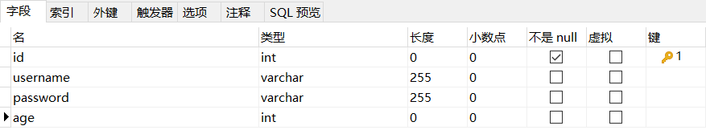

# demo项目

这是一个用Ray搭建的demo项目，业务层逻辑使用Python编写。实现了简单的用户登录、注册、注销和更新功能。

## 数据库表结构



## `apipost`接口说明

### 用户登录

#### 接口URL

> http://192.168.186.128:9090/user/login?username=test&password=123

#### 请求方式

> GET

#### Content-Type

> none

#### 请求Query参数

| 参数名 | 示例值 | 参数类型 | 是否必填 | 参数描述 |
| --- | --- | ---- | ---- | ---- |
| username | test | String | 是 | - |
| password | 123 | String | 是 | - |

#### 成功响应示例

```javascript
{
	"msg": "登陆成功"
}
```

#### 错误响应示例

```javascript
{
	"msg": "用户名或密码不正确"
}
```

### 用户信息更新

#### 接口URL

> http://192.168.186.128:9090/user/update

#### 请求方式

> POST

#### Content-Type

> json

#### 请求Body参数

```javascript
{
    "id":"3",
    "age":"25"
}
```

#### 成功响应示例

```javascript
{
	"msg": "用户信息更新成功"
}
```

### 用户注册

#### 接口URL

> http://192.168.186.128:9090/user/register

#### 请求方式

> POST

#### Content-Type

> json

#### 请求Body参数

```javascript
{
    "username":"test",
    "password":"123456"
}
```

#### 成功响应示例

```javascript
{
	"msg": "注册成功"
}
```

#### 错误响应示例

```javascript
{
	"msg": "用户名已存在"
}
```

### 用户注销

#### 接口URL

> http://192.168.186.128:9090/user/logout?id=1

#### 请求方式

> GET

#### Content-Type

> none

#### 请求Query参数

| 参数名 | 示例值 | 参数类型 | 是否必填 | 参数描述 |
| --- | --- | ---- | ---- | ---- |
| id | 1 | String | 是 | - |

#### 成功响应示例

```javascript
{
	"msg": "用户注销成功"
}
```
